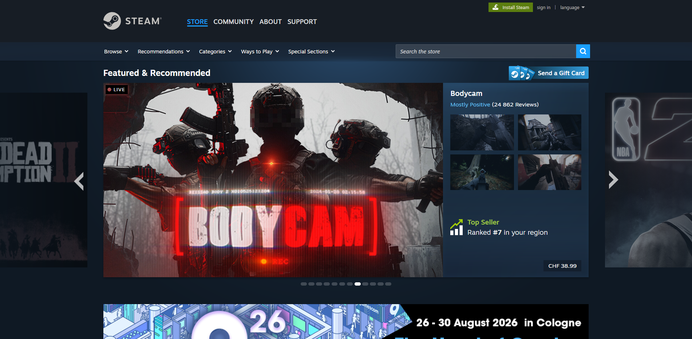
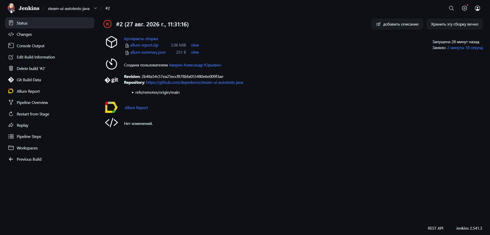
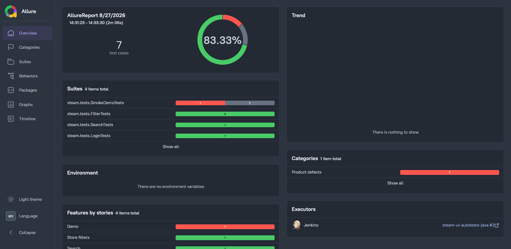
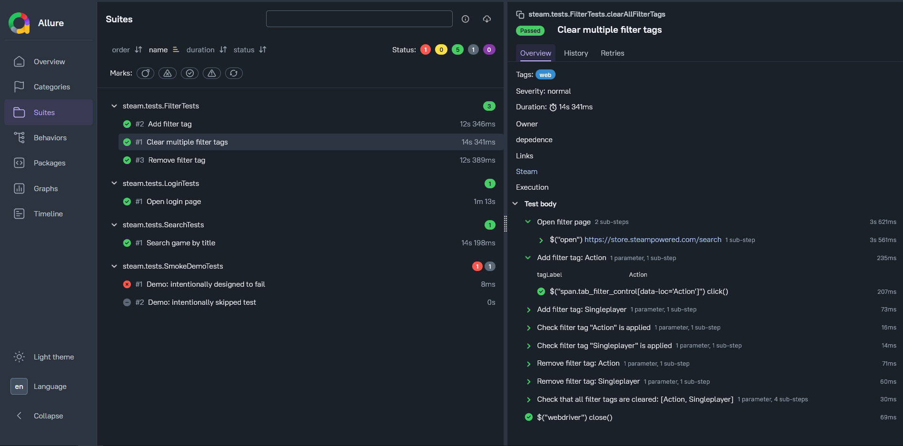
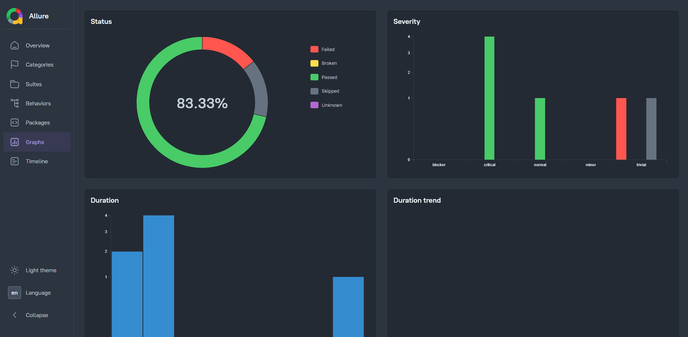

# <a target="_blank" href="https://store.steampowered.com/">Steam</a> UI Autotests (Java + Selenide) — Pet Project by depedence



Java-порт пет-проекта [Steam_UI_autotests](https://github.com/valentine-qa/Steam_UI_autotests) — UI-автотесты интернет-магазина Steam, переписанные со стека Python/Selene/pytest на Java/Selenide/JUnit5. Проект демонстрирует навыки тестирования, понимание кода, CI/CD и работы с Allure-отчётами.

---

### Check list of autotests

1. Search game by title.
2. Moving to login page.
3. Add tag filter on search page.
4. Remove tag filter on search page.
5. Clear multiple tag filters.
6. Demo tests (intentional fail/skip) — to demonstrate different statuses in Allure report.

---

### Used Tools

    
 <!--  -->   <!--  -->

---

### Project structure

```
src/test/java/steam/
├── BaseTest.java          # test lifecycle: Selenoid session setup/teardown, Allure video/screenshot attachments
├── config/
│   └── AppConfig.java     # reads .env / environment variables (Selenoid URL, base URL)
├── pages/
│   ├── MainPage.java
│   ├── SearchPage.java
│   ├── LoginPage.java
│   └── FilterPage.java
├── tests/
│   ├── SearchTests.java
│   ├── LoginTests.java
│   ├── FilterTests.java
│   └── SmokeDemoTests.java  # intentional fail/skip demo tests
└── utils/
    ├── Attach.java         # attaches Selenoid session video to Allure report
    ├── RetryUtils.java     # generic retry wrapper for flaky navigation
    └── NavigationUtils.java
```

---

### How to run locally

**Prerequisites:** JDK 17+, Maven, Docker Desktop.

1. Clone the repository:
   ```bash
   git clone https://github.com/depedence/steam-ui-autotests-java.git
   cd steam-ui-autotests-java
   ```

2. Copy `.env.example` to `.env` — no changes needed for local run (default Selenoid URL is `http://localhost:4444/wd/hub`).

3. Start Selenoid via Docker Compose:
   ```bash
   cd selenoid
   docker-compose up -d
   cd ..
   ```

4. Run tests:
   ```bash
   mvn clean test
   ```

5. View the Allure report:
   ```bash
   allure serve target/allure-results
   ```

---

### Run autotests with Jenkins

The project includes a `Jenkinsfile` for a declarative Jenkins Pipeline. Jenkins and Selenoid run together in Docker on the same network, so the pipeline connects to Selenoid via the container name (`selenoid:4444`) rather than `localhost`.



#### Pipeline stages

1. **Checkout** — clone the repository.
2. **Test** — `mvn clean test` against Selenoid.
3. **Post: Allure** — generate and archive the Allure report via the Allure Jenkins plugin.

---

### Allure report

#### Overall result



#### Test results with screenshots, HTML page source and session video



#### Graphs



---

### Take Jenkins administrator password

`docker exec jenkins cat //var/jenkins_home/secrets/initialAdminPassword`

---

### License

Distributed under the MIT License.
